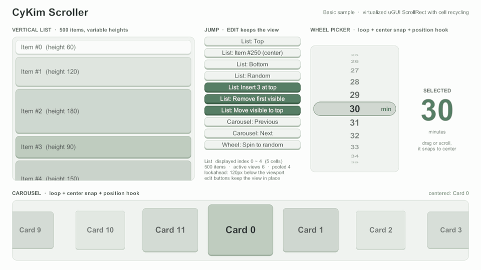
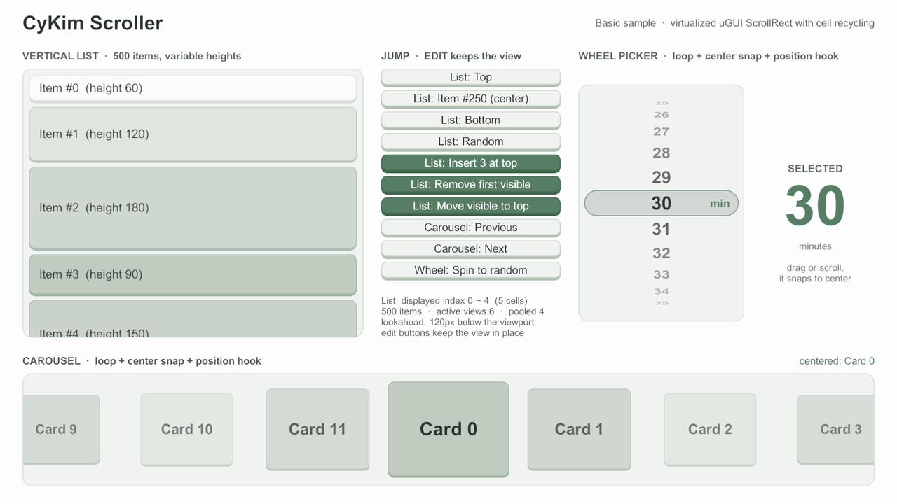

# cyKimScroller

Unity uGUI `ScrollRect` 위에서 동작하는 가상화 스크롤러. 보이는 구간의 셀 뷰만 만들어 재사용하고,
나머지는 빈 스크롤 길이로 둔다. 항목이 10만 개여도 셀 뷰는 보이는 구간과 미리 만들기 구간만큼만 있다.



<sub>Basic 샘플: 목록 가운데로 점프 → 맨 위 3개 삽입·보이는 항목을 맨 위로 이동·첫 항목 삭제(보던 화면 유지) → 휠 피커 회전 → 캐러셀 넘기기 → 맨 위로</sub>

## 특징

- **가상화와 풀링** — 세로·가로, 셀마다 다른 크기, 간격·패딩, 미리 만들기(lookAhead), `CellIdentifier` 단위 셀 뷰 풀
- **이동** — 데이터 인덱스 점프 + 31종 트윈·커스텀 곡선, 보이게만 옮기는 `ScrollIntoView`, 재배치·뷰포트 크기 변화에도 끊기지 않는 트윈
- **루프·스냅** — 무한 루프(짧은 목록도 뷰포트를 채움), 드래그·휠 뒤 스냅, 속도 상한
- **증분 변경** — `InsertCells`·`RemoveCells`·`MoveCell`·`RefreshCells`·`ReloadCellView`를 배치로 묶어 전체 리로드 없이 반영하고 보던 화면을 지킨다
- **안정 항목 ID** — 앞쪽에 항목이 끼어들거나 빠져도 보던 항목을 지키는 리로드, 항목 기준 위치 저장·복원, 같은 ID 셀을 다시 바인딩하지 않는 리로드(옵트인)
- **셀 훅** — 실제 뷰포트 기준 표시 이벤트, 늦은 비동기 결과를 버리는 `BindVersion`, 캐러셀·휠 피커 연출용 뷰포트 위치 훅
- **GC 0** — 스크롤 핫패스 할당 0을 PlayMode 테스트로 지킨다



## 설치

`Packages/manifest.json`에 git URL을 넣는다. 태그나 전체 커밋 SHA로 고정한다.

```json
{
  "dependencies": {
    "com.cykim.scroller": "https://github.com/cyKim0115/cyKimScroller.git?path=/Packages/com.cykim.scroller#v0.3.0"
  }
}
```

Unity 6000.0 이상, uGUI 2.0 이상 (6000.6.0f1 / uGUI 2.6.0에서 검증).

## 빠른 시작

1. Hierarchy 우클릭 → **UI (Canvas) → CyKim Scroller → Vertical Scroller** (Unity 6.2 이하는 **UI → CyKim Scroller**)
2. 셀 프리팹 루트에 `CyScrollerCellView`를 상속한 컴포넌트를 붙인다
3. 컨트롤러에서 `ICyScrollerDelegate`를 구현해 `Delegate`에 넣는다

```csharp
using CyKim.Scroller;
using UnityEngine;

public class InventoryList : MonoBehaviour, ICyScrollerDelegate
{
    [SerializeField] private CyScroller _scroller;
    [SerializeField] private ItemCellView _cellPrefab;   // : CyScrollerCellView

    private ItemData[] _items;

    private void Start()
    {
        _items = LoadItems();
        _scroller.Delegate = this;   // 다음 LateUpdate에 자동 ReloadData
    }

    public int GetNumberOfCells(CyScroller scroller) => _items.Length;

    public float GetCellViewSize(CyScroller scroller, int dataIndex) => 120f;

    public CyScrollerCellView GetCellView(CyScroller scroller, int dataIndex, int cellIndex)
    {
        var view = (ItemCellView)scroller.GetCellView(_cellPrefab);   // 풀에서 꺼내거나 생성
        view.SetData(_items[dataIndex]);
        return view;
    }
}
```

API 전체와 동작 규칙은 [패키지 README](Packages/com.cykim.scroller/README.md)에 있다.

## 샘플

Package Manager → CyKim Scroller → Samples → **Basic** Import → 빈 씬의 GameObject에 `BasicSample`을 붙이고 Play.
씬·프리팹 없이 UI를 코드로 만든다.

| 영역 | 보여 주는 것 |
|---|---|
| 왼쪽 목록 | 높이가 다른 500개 셀, 실제로 보이는 셀 수, 편집 버튼으로 증분 삽입·삭제·이동과 위치 유지 |
| 가운데 버튼 | 트윈 점프(처음·가운데·끝·무작위), 편집, 캐러셀·휠 이동 |
| 오른쪽 휠 피커 | 세로 루프 + 가운데 스냅, 위치 훅으로 원통에 감긴 모양 |
| 아래 캐러셀 | 가로 루프 + 스냅, 위치 훅으로 가운데 카드 강조 |

## 성능

- 스크롤 핫패스(스크롤 콜백·레이아웃 계산)에서 GC 할당 0 — PlayMode 테스트 `Scrolling_DoesNotAllocateAfterWarmup` 등
- Profiler 마커 `CyScroller.UpdateActiveRange`·`CyScroller.Relayout`·`CyScroller.ApplyUpdates`
- 스트레스 씬 `Assets/Dev/Scenes/DevStress.unity` — 10만 셀 자동 스크롤 + 프레임 GC HUD (이 저장소 전용)

## 저장소 구조

```
Packages/com.cykim.scroller/   패키지 본체 (Runtime · Editor · Tests · Samples~ · Documentation~)
Assets/Dev/                    이 저장소 전용 개발·검증 씬
docs/                          설계 조사 · 로드맵 · README 이미지
tools/                         샘플 임시 텍스처 생성 스크립트
```

## 설계 참고

특정 라이브러리와의 소스 호환은 목표가 아니다. 여러 플랫폼의 가상화 목록 UI가 공통으로 쓰는
델리게이트·셀 재사용 패턴을 uGUI `ScrollRect`에 맞게 새로 설계했다.

- iOS UIKit `UITableView`·`UICollectionView` — 데이터 소스, 셀 재사용 식별자, 배치 업데이트
- Android `RecyclerView` — 뷰 홀더 풀, 범위 알림(`notifyItem*`), 안정 ID
- Unity UI Toolkit `ListView` — 가상화, 항목 바인딩
- 웹 가상 리스트 라이브러리 — 가변 크기, 앵커 기반 위치 유지

개념 대응표는 [api-mapping.md](Packages/com.cykim.scroller/Documentation~/api-mapping.md),
조사 기록은 [docs/research](docs/research/2026-10-01-scroller-design-research.md).

## 문서

- [CHANGELOG](Packages/com.cykim.scroller/CHANGELOG.md)
- [로드맵](docs/roadmap/2026-10-01-scroller-roadmap.md)

## 라이선스

MIT — [LICENSE.md](Packages/com.cykim.scroller/LICENSE.md)
