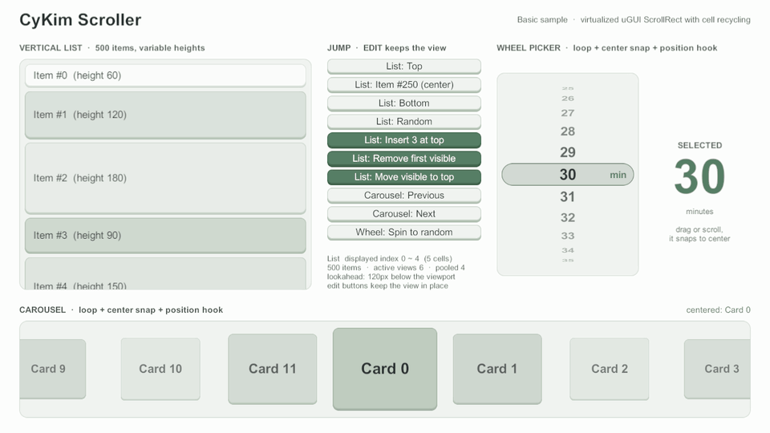

# CyKim Scroller

CyKim Scroller는 Unity uGUI `ScrollRect` 위에서 동작하는 가상화 스크롤러다.
보이는 구간의 셀 뷰만 만들어 재사용하고, 나머지는 빈 스크롤 길이로 둔다. 항목이 10만 개여도 셀 뷰는 화면과 미리 만들기 구간만큼만 있다.

<figure><figcaption><p>Basic 샘플: 목록 가운데로 점프 → 삽입·이동·삭제(보던 화면 유지) → 휠 피커 회전 → 캐러셀 넘기기 → 맨 위로</p></figcaption></figure>

<a href="getting-started/quick-start.md" class="button primary" data-icon="rocket">빠른 시작</a> <a href="https://github.com/cyKim0115/cyKimScroller" class="button secondary" data-icon="github">GitHub 저장소</a>

## 가이드

<table data-view="cards">
  <thead>
    <tr>
      <th></th>
      <th></th>
      <th data-hidden data-card-target data-type="content-ref"></th>
      <th data-hidden data-card-cover data-type="files"></th>
    </tr>
  </thead>
  <tbody>
    <tr>
      <td><strong>점프와 ScrollIntoView</strong></td>
      <td>데이터 인덱스로 이동하고, 31종 트윈으로 움직이고, 필요한 만큼만 보이게 옮긴다.</td>
      <td><a href="guides/jump-and-scroll-into-view.md">jump-and-scroll-into-view.md</a></td>
      <td><a href="../../.gitbook/assets/cover-jump.png">cover-jump.png</a></td>
    </tr>
    <tr>
      <td><strong>스냅과 루프</strong></td>
      <td>무한 루프와 가운데 스냅으로 캐러셀·휠 피커를 만든다.</td>
      <td><a href="guides/snap-and-loop.md">snap-and-loop.md</a></td>
      <td><a href="../../.gitbook/assets/cover-snap-loop.png">cover-snap-loop.png</a></td>
    </tr>
    <tr>
      <td><strong>셀 훅</strong></td>
      <td>실제로 보일 때의 이벤트, 늦은 비동기 결과 걸러내기, 뷰포트 위치에 따른 연출.</td>
      <td><a href="guides/cell-hooks.md">cell-hooks.md</a></td>
      <td><a href="../../.gitbook/assets/cover-cell-hooks.png">cover-cell-hooks.png</a></td>
    </tr>
    <tr>
      <td><strong>항목 ID와 위치 앵커</strong></td>
      <td>앞쪽에 항목이 끼어들어도 보던 항목을 지키고, 위치를 저장했다 복원한다.</td>
      <td><a href="guides/item-id-and-anchor.md">item-id-and-anchor.md</a></td>
      <td><a href="../../.gitbook/assets/cover-item-id.png">cover-item-id.png</a></td>
    </tr>
    <tr>
      <td><strong>증분 변경과 부분 갱신</strong></td>
      <td>바뀐 자리만 알려 전체 리로드 없이 삽입·삭제·이동·갱신을 반영한다.</td>
      <td><a href="guides/incremental-updates.md">incremental-updates.md</a></td>
      <td><a href="../../.gitbook/assets/cover-incremental.png">cover-incremental.png</a></td>
    </tr>
    <tr>
      <td><strong>성능</strong></td>
      <td>스크롤 중 GC 할당 0, Profiler 마커, 10만 셀 스트레스 씬.</td>
      <td><a href="guides/performance.md">performance.md</a></td>
      <td><a href="../../.gitbook/assets/cover-performance.png">cover-performance.png</a></td>
    </tr>
  </tbody>
</table>

## 특징

* **가상화와 풀링** — 세로·가로, 셀마다 다른 크기, 간격·패딩, 미리 만들기(lookAhead), `CellIdentifier` 단위 셀 뷰 풀
* **이동** — 데이터 인덱스 점프와 31종 트윈·커스텀 곡선, 보이게만 옮기는 `ScrollIntoView`, 재배치·뷰포트 크기 변화에도 끊기지 않는 트윈
* **루프·스냅** — 무한 루프(짧은 목록도 뷰포트를 채움), 드래그·휠 뒤 스냅, 속도 상한
* **증분 변경** — `InsertCells`·`RemoveCells`·`MoveCell`·`RefreshCells`·`ReloadCellView`를 배치로 묶어 보던 화면을 지키며 반영
* **안정 항목 ID** — 앞쪽 삽입·삭제에도 보던 항목을 지키는 리로드, 항목 기준 위치 저장·복원, 같은 ID 셀을 다시 바인딩하지 않는 리로드(옵트인)
* **셀 훅** — 실제 뷰포트 기준 표시 이벤트, 늦은 비동기 결과를 버리는 `BindVersion`, 캐러셀·휠 피커 연출용 뷰포트 위치 훅
* **GC 0** — 스크롤 핫패스 할당 0을 PlayMode 테스트로 지킨다

## 설치

Unity 6000.0 이상, uGUI 2.0 이상에서 동작한다 (6000.6.0f1 / uGUI 2.6.0에서 검증).



**Window → Package Manager → + → Install package from git URL...** 에 아래 주소를 넣는다.

```
https://github.com/cyKim0115/cyKimScroller.git?path=/Packages/com.cykim.scroller#v0.2.1
```



`Packages/manifest.json`의 `dependencies`에 추가한다.

```json
{
  "dependencies": {
    "com.cykim.scroller": "https://github.com/cyKim0115/cyKimScroller.git?path=/Packages/com.cykim.scroller#v0.2.1"
  }
}
```



태그 고정·업데이트·샘플 가져오기는 [설치](getting-started/installation.md)에 있다.

## 다음 단계

* [빠른 시작](getting-started/quick-start.md) — 델리게이트 하나와 셀 프리팹 하나로 첫 목록 띄우기
* [기본 개념](getting-started/concepts.md) — 델리게이트, 셀 식별자와 풀, 데이터 인덱스와 슬롯, lookAhead
* [패키지 설명서](../../Packages/com.cykim.scroller/README.md) — 전체 API와 동작 규칙
