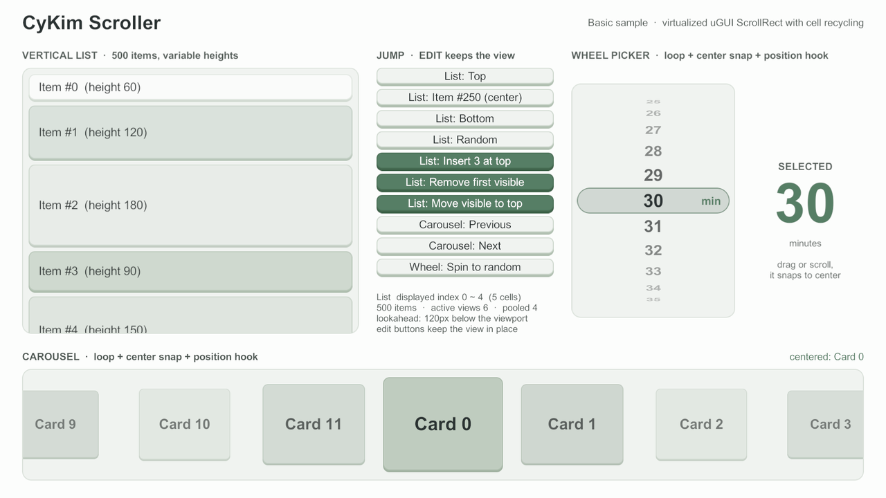

# 설치

CyKim Scroller는 git URL로 가져오는 UPM 패키지다. Unity 6000.0 이상, uGUI 2.0 이상이 필요하다 (6000.6.0f1 / uGUI 2.6.0에서 검증).

## 패키지 추가



1. **Window → Package Manager**를 연다.
2. 왼쪽 위 **+** 버튼 → **Install package from git URL...** 을 고른다.
3. 아래 주소를 넣고 **Install**을 누른다.

```
https://github.com/cyKim0115/cyKimScroller.git?path=/Packages/com.cykim.scroller#v0.3.0
```



`Packages/manifest.json`의 `dependencies`에 한 줄을 추가한다. 저장하면 Unity가 바로 가져온다.


```json
{
  "dependencies": {
    "com.cykim.scroller": "https://github.com/cyKim0115/cyKimScroller.git?path=/Packages/com.cykim.scroller#v0.3.0"
  }
}
```





주소의 `?path=` 다음에 `#`를 두고, 그 뒤에 **태그나 전체 커밋 SHA**를 적는다. 브랜치 이름이나 `#` 없는 주소는 가져올 때마다 다른 코드가 들어올 수 있다.


## 버전 올리기

`#v0.3.0` 부분을 새 태그로 바꾼다. 바뀐 점은 [변경 내역](../../../Packages/com.cykim.scroller/CHANGELOG.md)에 있다.

## 샘플 가져오기

Package Manager에서 **CyKim Scroller → Samples → Basic → Import**를 누른다.
빈 씬의 GameObject에 `BasicSample` 컴포넌트를 붙이고 Play하면 세로 목록, 점프·편집 버튼, 휠 피커, 루프 캐러셀이 만들어진다. 씬·프리팹 없이 UI를 코드로 만든다.

<figure><figcaption><p>Basic 샘플 (1280×720)</p></figcaption></figure>

| 영역 | 보여 주는 것 |
|---|---|
| 왼쪽 목록 | 높이가 다른 500개 셀, 실제로 보이는 셀 수, 편집 버튼으로 증분 삽입·삭제·이동과 위치 유지 |
| 가운데 버튼 | 트윈 점프(처음·가운데·끝·무작위), 편집, 캐러셀·휠 이동 |
| 오른쪽 휠 피커 | 세로 루프 + 가운데 스냅, 위치 훅으로 원통에 감긴 모양 |
| 아래 캐러셀 | 가로 루프 + 스냅, 위치 훅으로 가운데 카드 강조 |

## 테스트 돌려 보기

패키지 테스트를 Test Runner에서 보려면 `Packages/manifest.json`에 `testables`를 추가한다.

```json
{
  "testables": ["com.cykim.scroller"]
}
```

다음은 [빠른 시작](quick-start.md)이다.
