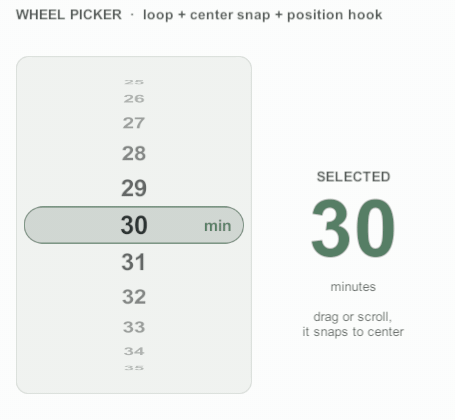

# 셀 훅

셀 뷰는 네 가지를 받을 수 있다.

| 알고 싶은 것 | 받는 곳 |
|---|---|
| 정말 화면에 보이기 시작했나 / 사라졌나 | `OnBecameVisible()` / `OnBecameHidden()`, 이벤트 `CellViewWillDisplay` / `CellViewDidEndDisplay` |
| 뷰포트 안 어디에 있나 | `OnViewportPositionChanged(normalizedOffset)`, 이벤트 `CellViewPositionChanged` |
| 지금 바인딩이 아직 유효한가 | `BindVersion` |
| 스크롤이 멈췄나 (미뤄 둔 로드 시작) | `OnScrollerSettled()`, 이벤트 `ScrollerSettled` — [정착과 고속 스크롤](settled-and-fast-scrolling.md) |

## 표시 이벤트

활성 범위에는 lookAhead로 미리 만든 셀도 들어 있다. 표시 이벤트는 그 셀을 빼고 **실제 뷰포트**에 걸칠 때만 온다.

| | `CellViewVisibilityChanged` | `CellViewWillDisplay` / `CellViewDidEndDisplay` |
|---|---|---|
| 기준 | 활성 범위 (뷰포트 + lookAhead) | 실제 뷰포트 |
| 시점 | 바인딩 직후 / 회수 직전 | 조금이라도 걸치기 시작할 때 / 완전히 벗어날 때 |
| 쓰임 | 바인딩 부가 작업, 리소스 관리 | 등장 애니메이션, 노출 기록, 동영상 재생·정지 |

```csharp
public class VideoCellView : CyScrollerCellView
{
    protected override void OnBecameVisible() { /* 재생 시작, 노출 기록 */ }
    protected override void OnBecameHidden()  { /* 정지 */ }
}
```

표시 시작과 끝은 셀마다 항상 짝이 맞는다. 보이던 셀이 리로드·삭제·`ClearActive`로 회수·파괴될 때도 표시 끝을 먼저 받는다.


**예외: 스크롤러 자체가 파괴될 때** (팝업 닫기·씬 언로드). 파괴 순서가 정해져 있지 않아 사용자 코드를 부르지 않고 바인딩만 푼다.
표시 중에 시작한 일(노출 타이머 등)은 셀의 `OnDestroy`에서 `IsDisplayed`를 보고 정리한다.


## BindVersion으로 늦은 비동기 결과 버리기

셀은 재사용되므로, 썸네일을 받는 사이 셀이 다른 항목에 바인딩될 수 있다. 바인딩할 때 `BindVersion`을 기억해 두고, 결과가 왔을 때 값이 다르면 버린다.


```csharp
public class ThumbnailCellView : CyScrollerCellView
{
    [SerializeField] private RawImage _image;

    public void SetData(Item item)
    {
        _image.texture = null;
        int version = BindVersion;   // 이 바인딩의 값
        ThumbnailLoader.Load(item.ThumbnailUrl, texture =>
        {
            // 그사이 회수·재바인딩되거나 스크롤러와 함께 파괴됐으면 값이 다르다
            if (this == null || version != BindVersion)
            {
                return;
            }

            _image.texture = texture;
        });
    }
}
```


`BindVersion`은 바인딩될 때와 바인딩이 풀릴 때(회수·파괴) 1씩 는다. `RefreshCells`로 내용만 다시 그리거나 증분 변경으로 인덱스만 바뀔 때는 늘지 않는다.

## 위치 훅

<figure><figcaption><p>휠 피커: 행마다 뷰포트 안 위치를 받아 기울기·크기·투명도를 바꾼다</p></figcaption></figure>

스크롤러의 `NotifyCellPositions`를 켜면, 위치가 바뀐 프레임마다 활성 셀이 뷰포트 안 위치를 받는다.

* `normalizedOffset` = 0이면 뷰포트 앞(위·왼쪽) 가장자리, 0.5면 가운데, 1이면 뒤 가장자리. 미리 만든 셀은 0 미만·1 초과일 수 있다.
* 셀의 어느 지점을 잴지는 `CellPositionPivot`(0 = 앞, 0.5 = 가운데, 1 = 뒤)으로 정한다.
* 새로 활성화된 셀은 활성화 즉시 한 번 받으므로 재사용된 셀이 이전 모습으로 한 프레임 보이지 않는다.


```csharp
public class CardCellView : CyScrollerCellView
{
    [SerializeField] private RectTransform _visual;   // 루트가 아닌 자식

    protected override void OnViewportPositionChanged(float normalizedOffset)
    {
        float distance = Mathf.Clamp01(Mathf.Abs(normalizedOffset - 0.5f) * 2f);
        float scale = Mathf.Lerp(1f, 0.75f, distance);
        _visual.localScale = new Vector3(scale, scale, 1f);
    }

    public override void OnRecycled()
    {
        // 재사용될 때 이전 자리의 효과를 되돌린다
        _visual.localScale = Vector3.one;
    }
}
```



셀 루트 RectTransform은 스크롤러가 배치한다. 위치 훅에서는 **자식**의 스케일·회전·투명도만 바꾼다.



셀 뷰 훅(`OnBecameVisible`·`OnBecameHidden`·`OnViewportPositionChanged`·`OnDataIndexChanged`·`OnScrollerSettled`)은 `protected internal`이다. 다른 어셈블리에서는 `protected override`로 재정의한다.
위치 훅은 레이아웃 캐시로만 계산해 할당이 없고, 꺼져 있으면 계산 자체를 건너뛴다.


## 더 보기

* [패키지 설명서 — 셀 훅 동작](../../../Packages/com.cykim.scroller/README.md#셀-훅-동작): 이벤트 순서, 콜백 안 이동, 위치 훅 계산식
