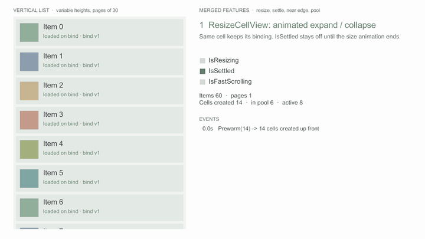

# 셀 크기 변경

<figure><figcaption><p>Item 1을 펼쳤다가 접는다. 같은 셀이라 bind 버전이 그대로이고, 애니메이션이 끝나면 정착 이벤트가 온다</p></figcaption></figure>


v0.3.0에서 추가된 기능이다 ([변경 내역](../../../Packages/com.cykim.scroller/CHANGELOG.md)). 이전 버전을 쓰고 있으면 설치 주소 끝을 `#v0.3.0`으로 올린다.


펼치기·접기처럼 셀 종류와 내용은 그대로이고 크기만 바뀌면 `ResizeCellView`를 부른다.

* 그 항목의 크기만 델리게이트에 다시 묻는다. 셀은 다시 바인딩하지 않는다 (`BindVersion` 그대로).
* `duration`을 주면 LateUpdate에서 그 시간 동안 크기를 바꾼다. 중간 걸음은 항목 수와 상관없이 활성 셀 수만큼만 든다.
* 화면에서 어느 가장자리를 지킬지 `ResizeAnchor`로 고른다.

## 기본 사용

델리게이트가 돌려줄 크기를 **먼저** 바꾼 뒤 알린다.

```csharp
public void Toggle(int dataIndex)
{
    _items[dataIndex].Expanded = !_items[dataIndex].Expanded;   // GetCellViewSize가 새 크기를 돌려준다

    // 0.25초 동안 바꾼다. 셀의 위쪽 가장자리를 화면에 고정해 아래로 펼쳐진다.
    _scroller.ResizeCellView(dataIndex, 0.25f, TweenType.EaseOutCubic, ResizeAnchor.Start);
}
```

| 인자 | 뜻 |
|---|---|
| `dataIndex` | 크기가 바뀐 항목. 범위 밖이면 아무것도 하지 않는다 |
| `duration` | 0 이하면 바로 바꾼다. 0보다 크면 지금 크기에서 새 크기까지 이 시간(초, unscaled) 동안 바꾼다 |
| `tweenType` | 크기 애니메이션 곡선. `Custom`은 `CustomTweenCurve`, `Immediate`는 바로 바꾼다 |
| `anchor` | 화면에서 제자리에 둘 기준 (아래 표) |

### 셀 안 버튼에서

셀 뷰의 `RequestResize(duration, tweenType, anchor)`는 그 셀의 `DataIndex`로 같은 일을 한다.


```csharp
public class FaqCellView : CyScrollerCellView
{
    [SerializeField] private Button _toggle;
    private FaqItem _item;

    private void Awake()
    {
        _toggle.onClick.AddListener(Toggle);   // 한 번만 연결하고, 지금 바인딩된 항목을 쓴다
    }

    public void SetData(FaqItem item)
    {
        _item = item;
    }

    private void Toggle()
    {
        _item.Expanded = !_item.Expanded;   // 델리게이트의 GetCellViewSize가 이 값으로 크기를 정한다
        RequestResize(0.25f, TweenType.EaseOutCubic, ResizeAnchor.Start);
    }
}
```



`DataIndex`는 배치 전 인덱스다. 증분 변경 배치(`BeginUpdates`) 안에서 구조 연산 뒤에 부를 때는 스크롤러의 `ResizeCellView`에 그 시점 인덱스를 직접 넘긴다.


## 화면 기준

| `ResizeAnchor` | 화면에서 지키는 것 |
|---|---|
| `Auto` (기본) | 다른 증분 변경과 같다. 뷰포트 맨 앞 항목보다 앞에서 생긴 변화만 보정하고, 맨 앞 항목 자신이거나 그 뒤면 옮기지 않는다 |
| `Start` | 그 셀의 시작(위·왼쪽) 가장자리. 셀은 아래·오른쪽으로 늘어나거나 줄어든다 |
| `End` | 그 셀의 끝(아래·오른쪽) 가장자리. 셀은 위·왼쪽으로 늘어나거나 줄어든다 |

결과는 스크롤 범위로 자른다. 목록 끝에서 셀을 줄이면 위치가 새 끝으로 맞춰지고, 가장자리 너머로 튕기지 않는다.

## 애니메이션 동작

* 같은 항목에 새 요청이 오면 지금 크기에서 이어 간다. 지금 크기와 같은 크기를 요청하면 애니메이션을 시작하지 않는다.
* 그 항목이 지워지거나, `ReloadCellView`·리로드로 크기를 다시 읽으면 애니메이션을 버리고 그 크기를 따른다.
* 진행 중인 점프 트윈은 바뀐 배치의 목표로 이어 가고 완료 콜백을 한 번 부른다. 점프·스냅·`ScrollIntoView` 정렬이 유지되는 중이면 정렬이 기준보다 먼저다.
* 드래그 중이면 손가락 아래 콘텐츠가 그대로 남는다.
* 배치(`BeginUpdates`) 안에서는 다른 증분 변경처럼 호출 순서대로 해석하고, 배치가 열려 있는 동안에는 멈췄다가 닫히면 이어 간다.
* `IsResizing`이 진행 여부다. 진행 중에는 [정착](settled-and-fast-scrolling.md)하지 않은 것으로 보고(화면 밖 항목 포함), 끝난 프레임에 `ScrollerSettled`가 온다.


크기의 기준은 계속 델리게이트다. 크기 값을 직접 받는 메서드는 없다 (다음 리로드 때 델리게이트 값으로 돌아가지 않게).
셀 종류(프리팹)나 내용이 바뀌었으면 [`ReloadCellView`·`RefreshCells`](incremental-updates.md)를 쓴다.



루프 모드에서는 애니메이션 없이 바로 바꾸고 위치를 지키는 재배치로 맞춘다 (활성 셀을 다시 바인딩하고 기준은 `Auto`).
델리게이트·셀 이벤트 콜백 안에서 부르면 다른 증분 변경처럼 범위 갱신 뒤 앵커 보존 리로드로 바뀌어 애니메이션 없이 바로 바뀐다.


## 비용

중간 걸음은 레이아웃 접두합을 다시 더하지 않고, 그 뒤 항목 위치에 변화량을 더해 계산한다. 10만 항목의 맨 앞 항목을 애니메이션해도 걸음마다 활성 셀 수만큼만 들고,
마지막 걸음이나 다른 크기·개수 변경 때 바뀐 자리부터 한 번 다시 더한다. Profiler에서는 `CyScroller.Resize` 마커로 한 걸음을 볼 수 있다.

## 더 보기

* [패키지 설명서 — 셀 크기 변경](../../../Packages/com.cykim.scroller/README.md#셀-크기-변경)
* [증분 변경과 부분 갱신](incremental-updates.md) — 같은 배치 규칙을 따른다
