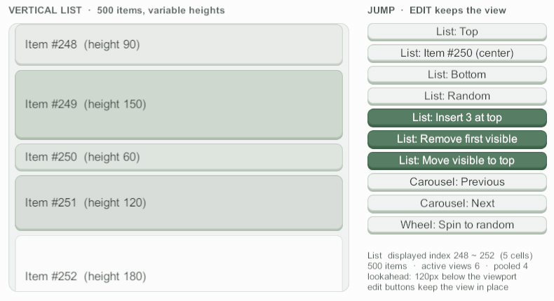

# 증분 변경과 부분 갱신

<figure><figcaption><p>맨 위에 3개 삽입 → 보이는 첫 항목 삭제 → 보이는 항목을 맨 위로 이동. 보던 화면이 그대로 남는다</p></figcaption></figure>

어느 자리가 바뀌었는지 알면 전체를 다시 읽지 않고 그 자리만 알린다.

* 새 항목만 크기(와 항목 ID)를 묻고, 남은 셀은 다시 바인딩하지 않는다.
* 뷰포트 맨 앞 항목보다 앞에서 생긴 크기 변화만큼 스크롤 위치를 옮겨 화면이 움직이지 않는다.
* 진행 중인 트윈·드래그도 끊기지 않는다.

## 구조 변경

**데이터를 먼저 바꾼 뒤** 알린다.

```csharp
// 한 연산은 바로 적용된다. 이 시점의 GetNumberOfCells가 이 연산까지 반영돼 있어야 한다.
_messages.InsertRange(0, older);
_scroller.InsertCells(0, older.Count);
```

| 메서드 | 뜻 |
|---|---|
| `InsertCells(dataIndex, count)` | `dataIndex` 자리에 `count`개 삽입 |
| `RemoveCells(dataIndex, count)` | `dataIndex`부터 `count`개 삭제 |
| `MoveCell(fromDataIndex, toDataIndex)` | 한 항목을 빼서 다른 자리에 넣기 |

### 배치로 묶기

여러 연산은 `BeginUpdates`~`EndUpdates`로 묶어 한 번에 적용한다. 각 연산의 인덱스는 **앞 연산까지 반영한 기준**이다.


```csharp
_scroller.BeginUpdates();
try
{
    _items.RemoveAt(3);
    _scroller.RemoveCells(3, 1);
    _items.Insert(0, pinned);
    _scroller.InsertCells(0, 1);
    Item moved = _items[10];      // 10번을 빼서 2번 자리에 넣는다
    _items.RemoveAt(10);
    _items.Insert(2, moved);
    _scroller.MoveCell(10, 2);
}
finally
{
    _scroller.EndUpdates();       // 여기서 GetNumberOfCells가 최종 개수와 맞으면 된다
}
```



`BeginUpdates`는 반드시 `EndUpdates`와 짝을 맞춘다. 닫히지 않은 배치는 범위 갱신·리로드를 계속 미뤄 스크롤해도 셀이 갱신되지 않는다. 사이 코드가 예외를 던질 수 있으면 `finally`에서 닫는다.



**인덱스는 호출 순서대로 해석한다.** 배치 전 인덱스로 삭제를, 배치 후 인덱스로 삽입을 해석하는 플랫폼에서 옮겨 올 때는 삭제를 큰 인덱스부터 먼저 부르고, 그다음 삽입을 작은 인덱스부터 부른다.
`EndUpdates`에서 개수가 맞지 않으면 경고를 남기고 위치를 지키는 리로드로 데이터와 다시 맞춘다.


### 셀이 받는 것

* 인덱스만 바뀐 셀은 `OnDataIndexChanged(previousDataIndex)`를 받는다 (`BindVersion` 그대로). 셀이 순번을 그린다면 여기서 다시 그린다.
* 지워진 항목의 셀은 회수한다 (보이던 셀은 표시 끝을 먼저 받는다).
* 새로 활성 범위에 들어온 자리만 델리게이트로 받는다.

## 부분 갱신

개수는 그대로이고 일부 항목의 내용만 바뀌었으면 그 항목만 알린다. 같은 배치에 섞을 수 있다.

```csharp
// 7번부터 3개 항목의 텍스트만 바뀜 → 그 항목의 활성 셀만 RefreshCellView(changeMask)
_scroller.RefreshCells(7, 3, MessageCellView.TEXT);

// 12번 항목의 셀 종류·크기가 바뀜 → 그 항목만 크기를 다시 묻고 셀을 다시 받는다
_scroller.ReloadCellView(12);
```

`changeMask`는 스크롤러가 해석하지 않는 사용자 정의 비트 플래그다. 셀 뷰가 `RefreshCellView(int changeMask)`를 재정의해 바뀐 부분만 다시 그린다.


```csharp
public class MessageCellView : CyScrollerCellView
{
    public const int TEXT = 1;
    public const int ICON = 2;

    // 무인자 RefreshActiveCellViews()도 같은 경로로 받는다.
    public override void RefreshCellView() => RefreshCellView(~0);

    // base를 부르지 않는다 (기본 구현이 RefreshCellView()를 불러 서로 부르게 된다).
    public override void RefreshCellView(int changeMask)
    {
        if ((changeMask & TEXT) != 0) { /* 텍스트 */ }
        if ((changeMask & ICON) != 0) { /* 아이콘 */ }
    }
}
```


배치 안에서는 항목마다 changeMask를 OR로 모아 `EndUpdates`에서 남은 셀마다 한 번만 부른다.

## 키 유지 리로드

바뀐 자리를 모르고 목록을 통째로 다시 받는 경우(서버 응답으로 목록 교체 등)에도 셀을 지킬 수 있다.
델리게이트가 [항목 ID](item-id-and-anchor.md)를 주고 `PreserveCellsById`를 켜면(기본 꺼짐, 인스펙터 **Reload → Preserve Cells By Id**), 위치를 지키는 리로드가 ID가 같은 셀을 다시 바인딩하지 않고 새 자리로 옮긴다.

```csharp
private void Awake()
{
    _scroller.PreserveCellsById = true;   // 인스펙터에서 켜도 된다
}

private void OnListArrived(List<Message> latest)
{
    _messages.Clear();
    _messages.AddRange(latest);
    _scroller.ReloadData(ReloadAnchor.FirstVisible);   // 남은 메시지의 셀은 옮기고 새 메시지만 바인딩

    // 키 유지 리로드는 내용 변경을 감지하지 않는다. 내용이 바뀐 항목은 리로드한 뒤 새 인덱스로 알린다.
    for (int i = 0; i < _messages.Count; i++)
    {
        if (_messages[i].IsEdited)
        {
            _scroller.RefreshCells(i, 1, MessageCellView.TEXT);
        }
    }
}
```

* 키 유지를 따르는 리로드는 `ReloadData(ReloadAnchor.FirstVisible / LastVisible)`·`ReloadData(in anchor)`·`ReloadDataKeepingPosition()`이다. 처음부터 다시 그리는 리로드는 모든 셀을 다시 바인딩한다.
* 같은 ID는 같은 셀 종류로 본다. 셀 종류가 바뀐 항목은 리로드한 뒤 `ReloadCellView`를 부른다.


루프 모드에서는 같은 데이터가 여러 슬롯에 있으므로 삽입·삭제·이동·다시 받기를 증분 대신 위치를 지키는 리로드로 처리한다. 내용 갱신만 있는 배치는 리로드하지 않는다.


## 더 보기

* [패키지 설명서 — 증분 변경 동작](../../../Packages/com.cykim.scroller/README.md#증분-변경-동작): 7가지 계약, 콜백 안 재진입, 트윈 대상이 지워질 때, 범위 밖 인자
