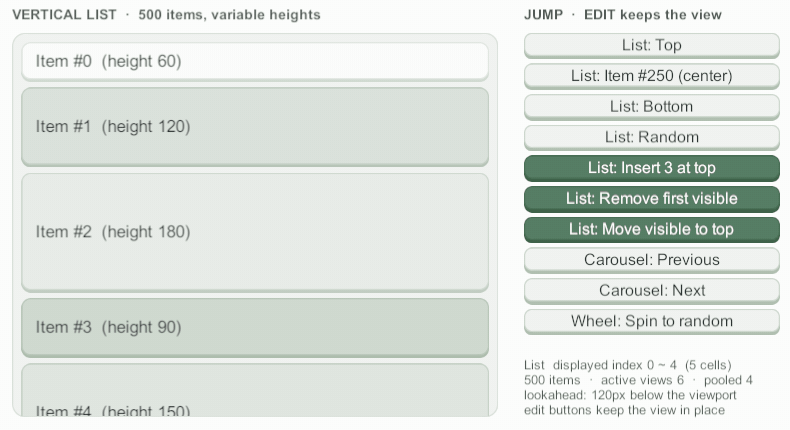

# 점프와 ScrollIntoView

<figure><figcaption><p>가운데 정렬 점프: Item #250 → 맨 아래 → 맨 위 (EaseInOutCubic, 0.4초)</p></figcaption></figure>

## JumpToDataIndex

항목 번호로 이동한다. 셀의 어느 지점을 뷰포트의 어느 지점에 맞출지 두 오프셋으로 정한다.

```csharp
// 250번 항목의 가운데를 뷰포트 가운데에, 0.4초 동안 EaseInOutCubic으로
_scroller.JumpToDataIndex(250, scrollerOffset: 0.5f, cellOffset: 0.5f,
    tweenType: TweenType.EaseInOutCubic, tweenTime: 0.4f,
    jumpComplete: () => Debug.Log("도착"));
```

| 인자 | 기본값 | 뜻 |
|---|---|---|
| `scrollerOffset` | 0 | 뷰포트의 맞출 지점. 0 = 앞(위·왼쪽), 0.5 = 가운데, 1 = 뒤 |
| `cellOffset` | 0 | 셀 안의 맞출 지점. 같은 기준 |
| `useSpacing` | true | 셀 앞뒤 간격의 절반씩을 셀 영역에 넣어 계산 |
| `tweenType` / `tweenTime` | `Immediate` / 0 | 이동 곡선과 시간 |
| `jumpComplete` | null | 도착했을 때 한 번 |
| `loopJumpDirection` | `Closest` | 루프에서 어느 쪽 사본으로 갈지 (`Forward`·`Backward`) |

가운데 정렬은 `JumpToDataIndex(i, 0.5f, 0.5f)`, 맨 위 정렬은 `JumpToDataIndex(i)`다.

### 트윈

`TweenType`은 `Immediate`·`Linear`와 Sine·Quad·Cubic·Quart·Quint·Expo·Circ·Back·Elastic·Bounce 계열의 In·Out·InOut, 그리고 `Custom`이 있다.
`Custom`은 스크롤러의 `CustomTweenCurve`(AnimationCurve)를 쓴다.

트윈은 목표 좌표를 저장하지 않고 요청(항목·정렬 지점)으로 매 프레임 다시 계산한다. 그래서 이동 중에 셀 크기·간격이 바뀌거나 뷰포트 크기가 바뀌어도 멈추거나 튀지 않고 새 목표로 이어 가며, 완료 콜백은 한 번 불린다.


다음 경우 트윈은 그 자리에서 멈추고 **완료 콜백을 부르지 않는다**: `ReloadData`, `InterruptTween()`, 사용자 드래그·휠, 포인터 다운(`InterruptTweenOnPointerDown`을 켰을 때), `ScrollPosition` 대입.


### 정렬 유지

점프·스냅·`ScrollIntoView`로 맞춘 정렬은 사용자가 드래그·휠·스크롤바로 움직이거나 `ScrollPosition`을 직접 바꾸기 전까지 유지된다.
첫 프레임에 Canvas 크기가 확정되거나 화면이 회전해도 같은 셀이 같은 자리에 있다.

## ScrollIntoView

셀이 **보이게만** 옮긴다. 선택 항목을 따라가는 목록·키보드 이동에 쓴다.

```csharp
// 선택 항목이 화면 밖이면 가까운 쪽 가장자리에 붙이고, 앞뒤로 8px을 남긴다
_scroller.ScrollIntoView(selectedIndex, margin: 8f, tweenType: TweenType.EaseOutCubic, tweenTime: 0.2f);
```

| `align` | 동작 |
|---|---|
| `Nearest` (기본) | 이미 완전히 보이면 움직이지 않고 바로 완료 콜백. 앞쪽에 걸리면 셀 시작을 뷰포트 시작에, 뒤쪽이면 셀 끝을 뷰포트 끝에 맞춘다. 셀이 여백까지 합쳐 뷰포트보다 크면 Start |
| `Start` / `Center` / `End` | 점프처럼 항상 그 정렬로 맞춘다 |

* `margin`은 셀 앞뒤로 남길 거리다 (`Center`에는 쓰지 않는다). 콘텐츠 끝 너머로는 남길 수 없으므로 첫·마지막 셀은 콘텐츠 끝까지 보이면 된다.
* "보인다"는 lookAhead를 뺀 실제 뷰포트 기준이다. 미리 확인만 하려면 `IsDataIndexFullyVisible(dataIndex, margin)`을 쓴다.


드래그 중에 `JumpToDataIndex`·`Snap`·`ScrollIntoView`를 부르면 그 드래그를 끝내고 이동한다 (코드 요청 우선). `Nearest`는 실제로 움직여야 할 때만 드래그를 끝낸다.


## 더 보기

* [패키지 설명서 — 동작 규칙](../../../Packages/com.cykim.scroller/README.md#동작-규칙): 트윈 재계산, 곡선별 이어 가기, 콜백 안 이동
* [스냅과 루프](snap-and-loop.md): 루프에서 방향을 고르는 점프
