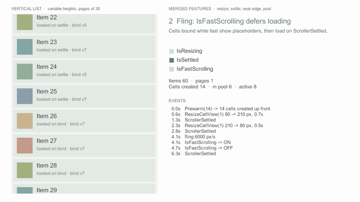

# 끝 근접과 페이지 불러오기

<figure><figcaption><p>끝까지 600px 남으면 다음 페이지를 요청하고, 도착하면 InsertCells로 붙인다 (60 → 90 → 120개)</p></figcaption></figure>


v0.2.1 다음 버전에 들어갈 기능이다 ([변경 내역](../../../Packages/com.cykim.scroller/CHANGELOG.md)의 Unreleased). 다음 태그 전까지는 설치 주소 끝의 `#v0.2.1`을 master의 커밋 SHA로 바꿔 쓴다.


`NearEdgeDistance`(px, 기본 0 = 끔)를 정하면, 콘텐츠 처음·끝까지 남은 거리가 그 값 이하가 될 때 `ScrollerNearEdge(scroller, edge)`가 가장자리마다 한 번 온다.
무한 스크롤 목록에서 다음 페이지를 미리 불러오는 데 쓴다.

## 다음 페이지 불러오기


```csharp
private bool _loading;
private bool _lastPageLoaded;

private void Awake()
{
    _scroller.NearEdgeDistance = 600f;   // 끝까지 600px 남으면 (인스펙터 Scrolling에서도 정할 수 있다)
    _scroller.ScrollerNearEdge += OnNearEdge;
}

private void OnNearEdge(CyScroller scroller, ScrollEdge edge)
{
    if (edge != ScrollEdge.End || _loading || _lastPageLoaded)
    {
        return;
    }

    _loading = true;
    LoadNextPage(page =>
    {
        _loading = false;
        _lastPageLoaded = page.Count == 0;
        int at = _items.Count;
        _items.AddRange(page);
        _scroller.InsertCells(at, page.Count);   // 개수가 바뀌면 다시 알릴 수 있게 열린다
    });
}
```


알림은 LateUpdate 끝에서 온다. 범위 갱신 콜백 밖이므로 핸들러 안에서 바로 `InsertCells`·`ReloadData`를 불러도 된다.
붙인 페이지는 [증분 변경](incremental-updates.md)으로 들어가므로 전체를 다시 읽지 않고, 보던 화면도 그대로 남는다.

## 언제 다시 알리나

알린 가장자리는 잠긴다. 같은 자리에서 반복해 알리지 않게 하기 위해서다.

| 상황 | 동작 |
|---|---|
| 남은 거리가 `NearEdgeDistance` 이하로 들어옴 | 그 가장자리를 한 번 알리고 잠근다 |
| 잠긴 채 근처에서 오감 | 다시 알리지 않는다 |
| 남은 거리가 `NearEdgeDistance` × 1.5를 넘게 멀어짐 | 다시 연다 |
| 데이터 개수가 바뀜 (삽입·삭제·리로드가 끝난 뒤) | 두 가장자리를 다시 연다. 아직 가까우면 다음 판단에서 다시 알린다 |
| 개수가 그대로인 리로드 | 다시 열지 않는다 |

그래서 페이지를 붙였는데도 아직 끝 근처면(페이지가 작으면) 바로 다음 페이지를 다시 요청한다.

## 짧은 목록과 빈 목록

콘텐츠가 뷰포트보다 짧으면(빈 목록 포함) 처음과 끝이 같으므로 `End`만 알린다. 첫 페이지가 화면을 다 채우지 못해도 화면이 찰 때까지 페이지를 이어 불러올 수 있다.

## 위쪽으로 불러오기

채팅의 지난 메시지처럼 위쪽으로 불러올 때는 `Start`를 받아 맨 앞에 넣는다. 맨 앞에 넣은 만큼 스크롤 위치가 옮겨져 보던 메시지가 그대로 남는다.

```csharp
private void OnNearEdge(CyScroller scroller, ScrollEdge edge)
{
    if (edge != ScrollEdge.Start || _loading || _reachedOldest)
    {
        return;
    }

    _loading = true;
    LoadOlder(older =>
    {
        _loading = false;
        _reachedOldest = older.Count == 0;
        _messages.InsertRange(0, older);
        _scroller.InsertCells(0, older.Count);   // 보던 화면을 지킨다
    });
}
```


맨 위에서 시작하면 첫 판단에서 `Start`도 온다. 목록을 맨 아래에서 시작하는 화면이면, 맨 아래로 옮긴 뒤에 `NearEdgeDistance`를 켠다.


## 알리지 않는 경우

* `NearEdgeDistance`가 0일 때 (기본)
* 루프 모드일 때, 뷰포트 길이가 0일 때
* 증분 변경 배치가 열려 있는 동안 (닫힌 뒤 판단한다)

가장자리 너머(Elastic)로 당긴 거리는 남은 거리에 넣지 않는다. 짧은 목록을 당겼다 놓아도 다시 열리지 않는다.

## 더 보기

* [패키지 설명서 — 끝 근접과 페이지 불러오기](../../../Packages/com.cykim.scroller/README.md#끝-근접과-페이지-불러오기)
* [풀 미리 채우기와 회수 상한](pool-prewarm.md) — 페이지가 늘어도 셀 뷰는 풀에서 돌려 쓴다
