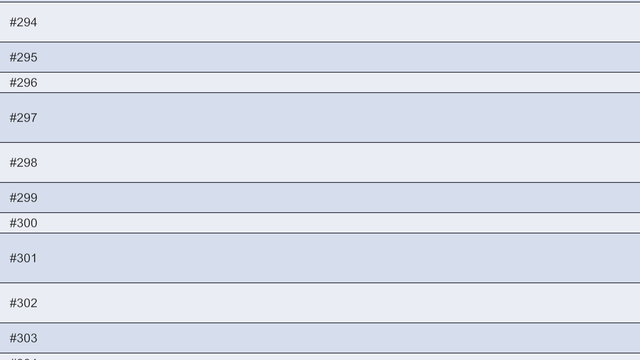

# 성능

## 할당 0 핫패스

스크롤 콜백과 레이아웃 계산(위치 → 항목 찾기, 활성 범위 갱신, 루프 순환 보정, 위치 훅)은 워밍업 뒤 GC 할당을 만들지 않는다.
패키지의 PlayMode 테스트가 이를 지킨다.

| 테스트 | 지키는 경로 |
|---|---|
| `Scrolling_DoesNotAllocateAfterWarmup` | 일반 스크롤 |
| `TweenUpdate_DoesNotAllocateAfterWarmup` | 트윈 이동 |
| `LoopScrollSweep_WithRecenter_DoesNotAllocateAfterWarmup` | 루프 순환 보정 |
| `CellHooks_ScrollSweep_DoesNotAllocateAfterWarmup` | 표시 이벤트·위치 훅을 켠 스크롤 |
| `Scrolling_WithItemIds_DoesNotAllocateAfterWarmup` | 항목 ID를 쓰는 스크롤 |
| `InsertRemoveMove_AfterWarmup_DoesNotAllocate` | 증분 삽입·삭제·이동 |
| `RefreshAndReload_AfterWarmup_DoesNotAllocate` | 부분 갱신·다시 받기 |
| `PreservingReloads_AfterWarmup_DoNotAllocate` | 키 유지 리로드 |
| `ResizeAnimation_AfterWarmup_DoesNotAllocate` | 셀 크기 애니메이션 |
| `ScrollState_DoesNotAllocate` | 정착·고속 스크롤 판단 |
| `NearEdges_DoesNotAllocate` | 끝 근접 판단 |
| `RecycleWithCap_DoesNotAllocate` | 회수 상한을 둔 스크롤 |
| `AllFeaturesOn_ScrollResizeSettleNearEdge_DoesNotAllocate` | 위 네 기능을 모두 켠 스크롤 |

"워밍업"은 풀이 뷰포트 + 미리 만들기 구간 분량의 셀을 만들어 두고, 크기·ID 배열이 개수만큼 커진 상태다. 그 뒤로는 셀을 새로 만들지 않고 풀에서 돌려 쓴다.
첫 스크롤의 셀 생성 비용도 피하려면 [풀 미리 채우기](pool-prewarm.md)로 화면을 열 때 만들어 둔다.

## 내 코드에서 지킬 것

스크롤러가 할당하지 않아도 델리게이트·셀 코드가 할당하면 프레임마다 GC가 쌓인다.

* `GetCellView`·`OnViewportPositionChanged`처럼 스크롤 중에 불리는 곳에서 문자열 조합·LINQ·박싱을 피한다. 라벨은 데이터를 만들 때 미리 만들어 둔다.
* 완료 콜백·이벤트 핸들러로 넘기는 람다가 지역 변수를 캡처하면 부를 때마다 할당된다. 메서드를 필드에 한 번 담아 재사용한다.
* `ActiveCellViews`는 `IReadOnlyList`다. `foreach` 대신 `for` + 인덱서로 순회한다.

```csharp
private System.Action _onJumpComplete;

private void Awake()
{
    _onJumpComplete = OnJumpComplete;   // 한 번만 만든다
}

public void Next()
{
    _scroller.JumpToDataIndex(_next, 0.5f, 0.5f, false, TweenType.EaseOutBack, 0.35f, _onJumpComplete);
}
```

## 비용이 드는 지점

| 작업 | 비용 |
|---|---|
| `ReloadData` 계열 | 모든 항목의 크기(와 ID)를 묻는다 — O(N) |
| `InsertCells`·`RemoveCells`·`MoveCell` | 배열을 `Array.Copy`로 옮기고 새 항목만 묻는다. 접두합은 바뀐 가장 앞 자리부터 다시 더한다 |
| `RefreshCells` | 레이아웃을 바꾸지 않고 그 항목의 활성 셀만 다시 그린다 |
| `ReloadCellView` | 그 항목만 크기를 다시 묻고 셀을 다시 받는다 |
| `ResizeCellView` | 그 항목만 크기를 다시 묻고 셀은 다시 받지 않는다. 애니메이션 중간 걸음은 활성 셀 수만큼 ([셀 크기 변경](cell-resize.md)) |
| 위치 훅 | 위치가 바뀐 프레임에 활성 셀 수만큼. 꺼져 있으면 계산하지 않는다 |
| lookAhead | 늘리면 가장자리에서 셀이 늦게 나타나는 일이 줄지만 활성 셀이 늘어난다 |

목록이 크고 자주 바뀌면 리로드 대신 [증분 변경](incremental-updates.md)을 쓴다.

## Profiler 마커

| 마커 | 내용 |
|---|---|
| `CyScroller.UpdateActiveRange` | 활성 범위 갱신 (셀 바인딩 포함) |
| `CyScroller.Relayout` | 위치를 지키는 재배치 |
| `CyScroller.ApplyUpdates` | 증분 변경 적용 |
| `CyScroller.Resize` | 셀 크기 애니메이션 한 걸음 |

`GetCellView`의 바인딩 비용은 `UpdateActiveRange` 안에 잡힌다. 무거운 바인딩은 여기서 먼저 보인다.

## 10만 셀 스트레스 씬

<figure><figcaption><p>DevStress 씬: 10만 셀 자동 왕복 스크롤 (이 저장소 전용 씬)</p></figcaption></figure>

저장소의 `Assets/Dev/Scenes/DevStress.unity`는 셀 10만 개를 자동으로 왕복 스크롤하며 활성 셀 수와 프레임당 GC를 HUD에 띄운다. 패키지에는 들어 있지 않다.


HUD의 프레임 할당에는 에디터 자체와 uGUI `Text` 메시 재생성 몫이 섞인다. 스크롤러만의 할당은 위 PlayMode 테스트로 확인한다.

