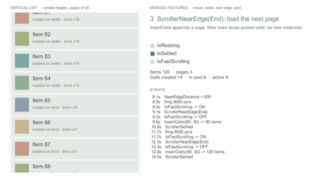

# 풀 미리 채우기와 회수 상한

<figure><figcaption><p>처음에 14개를 미리 만들고, 페이지가 3개로 늘어도 그 14개만 돌려 쓴다</p></figcaption></figure>


v0.2.1 다음 버전에 들어갈 기능이다 ([변경 내역](../../../Packages/com.cykim.scroller/CHANGELOG.md)의 Unreleased). 다음 태그 전까지는 설치 주소 끝의 `#v0.2.1`을 master의 커밋 SHA로 바꿔 쓴다.


셀 뷰는 처음 필요할 때 프리팹에서 만들어진다(Instantiate). 셀이 무거우면 첫 스크롤에서 끊김이 보일 수 있다.
미리 채우기는 이 비용을 화면을 여는 순간이나 로딩 중으로 옮긴다. 회수 상한은 드물게 쓰는 큰 셀이 풀에 오래 남지 않게 한다.

## 미리 채우기



```csharp
private void Awake()
{
    // 화면을 채울 만큼(뷰포트 + 미리 만들기 구간) 만든다.
    _scroller.Prewarm(_messagePrefab, 12);
    _scroller.Delegate = this;
}
```



```csharp
private IEnumerator Start()
{
    // Object.InstantiateAsync로 만든다. 끝날 때까지 기다릴 수 있다 (할 일이 없으면 null).
    yield return _scroller.PrewarmAsync(_messagePrefab, 12);
    _scroller.Delegate = this;
}
```



* 그 식별자 풀의 회수 셀(과 진행 중인 비동기 요청)을 세어 `count`가 될 때까지만 만든다. 이미 차 있으면 만들지 않는다.
* 만든 셀은 content 아래에서 꺼 두고 `CellViewInstantiated`를 부른다. 프리팹이 켜져 있으면 셀의 `Awake`·`OnEnable`은 끄기 전에 한 번 불린다.
* `PrewarmAsync`가 끝나기 전에 스크롤러가 파괴되면 만든 셀을 모두 파괴한다. 그사이 `ClearRecycled`를 불러도 진행 중인 요청은 끝나면 풀에 넣는다.


몇 개를 만들지는 뷰포트와 미리 만들기 구간(lookAhead)에 들어가는 셀 수에 한두 개를 더하면 된다. 셀 종류가 여럿이면 종류마다 따로 부른다.
Play 중 인스펙터 Runtime 영역의 Recycled Views, 또는 `GetRecycledCellCount()`로 풀에 남은 수를 볼 수 있다.


## 회수 상한

```csharp
// 드물게 쓰는 큰 배너 셀은 2개까지만 남긴다. 넘치면 가장 오래 회수된 셀부터 파괴한다.
_scroller.SetMaxRecycled(_bannerPrefab.CellIdentifier, 2);
```

| 설정 | 뜻 |
|---|---|
| `SetMaxRecycled(cellIdentifier, n)` | 그 식별자 풀에 n개까지 남긴다. 0이면 제한 없음, 음수면 기본값을 따른다 |
| `DefaultMaxRecycled` (인스펙터 Pool) | 식별자별 값이 없을 때 쓰는 상한. 기본 0 = 제한 없음 |
| `GetMaxRecycled(cellIdentifier)` | 그 식별자에 지금 적용되는 상한 |

상한을 바꾸면 넘친 만큼 바로 줄인다. 미리 채우기도 상한까지만 만든다.


상한은 풀에 남는 셀만 제한한다. 활성 셀 수는 제한하지 않으므로, 상한을 화면에 필요한 수보다 작게 두면 스크롤할 때마다 파괴와 생성이 반복된다.


## 더 보기

* [패키지 설명서 — 풀 미리 채우기와 상한](../../../Packages/com.cykim.scroller/README.md#풀-미리-채우기와-상한)
* [기본 개념 — 셀 식별자와 풀](../getting-started/concepts.md)
* [성능](performance.md)
