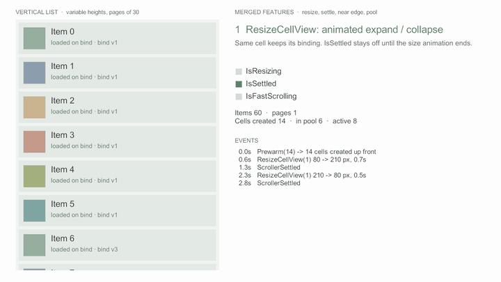

# 정착과 고속 스크롤

<figure><figcaption><p>빠르게 넘기는 동안 바인딩된 셀은 플레이스홀더로 두고, 정착하면 그 셀만 불러온다</p></figcaption></figure>


v0.2.1 다음 버전에 들어갈 기능이다 ([변경 내역](../../../Packages/com.cykim.scroller/CHANGELOG.md)의 Unreleased). 다음 태그 전까지는 설치 주소 끝의 `#v0.2.1`을 master의 커밋 SHA로 바꿔 쓴다.


썸네일·동영상처럼 무거운 로드를 셀마다 바로 시작하면, 빠르게 지나가는 셀까지 불러오느라 네트워크와 메모리를 쓴다.
빠르게 스크롤하는 동안은 플레이스홀더만 두고, 스크롤이 멈춘 뒤 그때 보이는 셀만 불러온다.

## 상태와 이벤트

| | 언제 |
|---|---|
| `IsScrolling` / `ScrollerScrollingChanged` | 드래그·관성 이동이 시작·끝날 때 (트윈 제외) |
| `IsTweening` / `ScrollerTweeningChanged` | 점프·스냅 트윈이 시작·끝날 때 |
| `IsSettled` / `ScrollerSettled` | 드래그·관성·트윈·스냅 대기·크기 애니메이션이 모두 끝나 정착했을 때 한 번 |
| `IsFastScrolling` / `ScrollerFastScrollingChanged` | 스크롤 속도가 고속 기준을 넘거나 그 아래로 떨어질 때 |

정착하면 `ScrollerSettled` 다음에 활성 셀(미리 만들기 구간 포함)마다 셀 뷰의 `OnScrollerSettled()`가 불린다.

## 플레이스홀더 패턴


```csharp
public class ThumbnailCellView : CyScrollerCellView
{
    private Item _item;
    private bool _loaded;

    public void SetData(Item item)
    {
        _item = item;
        _loaded = false;
        ShowPlaceholder();
        if (!Scroller.IsFastScrolling)
        {
            LoadThumbnail();   // 천천히 지나가면 바로 불러온다
        }
    }

    // 정착하면 활성 셀마다 한 번 불린다. 고속 스크롤 중에 미룬 로드를 시작한다.
    protected override void OnScrollerSettled()
    {
        if (!_loaded)
        {
            LoadThumbnail();
        }
    }
}
```


`LoadThumbnail`이 비동기라면 [`BindVersion`](cell-hooks.md)으로 늦게 도착한 결과를 걸러 낸다. 그사이 셀이 다른 항목에 다시 쓰였을 수 있다.

## 언제 정착으로 보나

정착은 아래가 모두 맞을 때다.

* 드래그 중이 아니다.
* 점프·스냅 트윈이 없고, 드래그·휠 뒤 스냅 대기도 없다.
* [크기 애니메이션](cell-resize.md)이 없다 (화면 밖 항목 포함).
* 관성 속도가 `SettleVelocityThreshold`(기본 10px/s) 이하다. 관성이 아주 느려진 끝도 정착으로 본다.
* 가장자리 너머(Elastic)에서 되돌아오는 중이 아니다. 되돌아오는 꼭짓점에서 속도가 0을 지나도 범위 안으로 돌아온 뒤 한 번만 정착한다.

정착 이벤트는 정착하지 않은 상태에서 정착으로 **바뀔 때** LateUpdate 끝에서 한 번 온다. 첫 로드 직후에는 오지 않는다.


휠·스크롤바 이동은 ScrollRect가 속도 없이 위치만 바꾸므로 정착으로 본다. 스냅을 켜면 휠 뒤 스냅 대기 동안은 정착이 아니다.



`ScrollerSettled` 핸들러가 다시 움직이게 하면(점프 트윈 시작, 크기 애니메이션 시작 등) 셀의 `OnScrollerSettled`는 이번에는 불리지 않고 다음 정착 때 불린다.


## 고속 스크롤 기준

속도는 트윈 중이면 트윈 이동 속도, 아니면 ScrollRect 관성 속도다. 기준은 뷰포트 길이의 배수(/s)라 해상도에 덜 민감하다.

| 속성 (인스펙터 Scroll State) | 기본값 | 뜻 |
|---|---|---|
| `SettleVelocityThreshold` | 10 | 정착으로 볼 관성 속도 상한(px/s). 0이면 완전히 멈춰야 정착 |
| `FastScrollEnterThreshold` | 3 | 뷰포트 길이 × 이 값(/s) 이상이면 고속 스크롤이 켜진다. 0이면 고속 스크롤을 끈다 |
| `FastScrollExitThreshold` | 1.5 | 뷰포트 길이 × 이 값(/s) 미만이면 꺼진다. 들어가는 값보다 크면 들어가는 값을 쓰고, 0이면 완전히 멈출 때 꺼진다 |

예를 들어 뷰포트가 640px이면 1920px/s 이상에서 켜지고 960px/s 아래로 떨어지면 꺼진다. 두 값을 따로 두어 경계에서 깜빡이지 않는다.


ScrollRect의 inertia를 끄면 드래그 중 속도는 0이다. 두 상태 모두 스크롤러가 꺼져 있는 동안에는 갱신하지 않고, 다시 켜진 뒤 LateUpdate에서 맞춘다.
Play 중 인스펙터 Runtime 영역에서 Settled·Fast Scrolling·Resizing을 볼 수 있다.


## 더 보기

* [패키지 설명서 — 정착과 고속 스크롤](../../../Packages/com.cykim.scroller/README.md#정착과-고속-스크롤)
* [셀 훅](cell-hooks.md) — 실제로 보일 때의 이벤트와 늦은 비동기 결과 걸러내기
