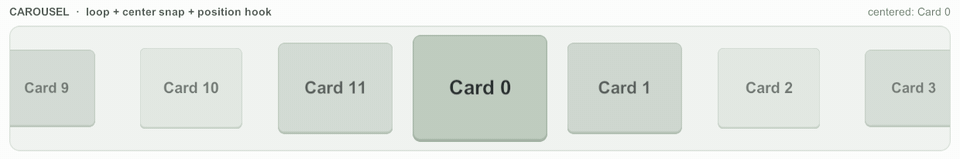

# 스냅과 루프

<figure><figcaption><p>가로 루프 캐러셀: 다음 ×3 → 이전. 카드 크기·색은 위치 훅으로 바꾼다</p></figcaption></figure>

## 루프

`Loop`를 켜면 끝에서 처음으로 이어지는 무한 목록이 된다.

```csharp
_scroller.Loop = true;   // 인스펙터 Loop 섹션에서 켜도 된다
```

* 같은 데이터를 여러 세트 이어 붙이고, 끝 쪽 세트에 가까워지면 가운데 세트로 순간이동한다 (순환 보정). 셀을 다시 바인딩하지 않으므로 보이는 화면은 그대로다.
* 세트 수는 뷰포트·미리 만들기 구간을 덮고도 양쪽에 한 사이클씩 남도록 정한다(최소 5). 그래서 항목이 3개뿐이어도 뷰포트를 채운다.
* `LoopWhileDragging`을 끄면 드래그하는 동안에는 순환 보정을 미루고 손을 뗄 때 한다. 켜 두면(기본) 드래그 중에도 손가락 아래 기준점을 같이 옮겨 끊기지 않는다.


루프에서 `ScrollPosition`은 내부 슬롯 좌표다. 위치를 저장·복원할 때는 `NormalizedScrollPosition`(한 사이클 안의 0~1)이나 `CaptureAnchor`/`RestoreAnchor`를 쓴다.
스크롤 축 스크롤바는 루프 동안 숨긴다.


### 루프에서 점프 방향

한 항목이 여러 슬롯에 있으므로 점프할 때 어느 사본으로 갈지 고를 수 있다.

| `LoopJumpDirection` | 동작 |
|---|---|
| `Closest` (기본) | 가장 가까운 사본 |
| `Forward` | 앞으로(아래·오른쪽) 가는 사본. "다음" 버튼 |
| `Backward` | 뒤로 가는 사본. "이전" 버튼 |

## 스냅

`Snapping`을 켜면 드래그·휠을 놓은 뒤 속도가 `SnapVelocityThreshold`(기본 200) 아래로 떨어질 때 가장 가까운 셀에 맞춘다. 누르고 있는 동안은 기다린다.

| 프로퍼티 | 기본값 | 뜻 |
|---|---|---|
| `SnapWatchOffset` | 0.5 | 뷰포트의 어느 지점에 걸친 셀을 고를지 (0 = 앞, 1 = 뒤) |
| `SnapJumpToOffset` | 0.5 | 고른 셀을 뷰포트의 어느 지점에 맞출지 |
| `SnapCellCenterOffset` | 0.5 | 셀 안의 어느 지점을 맞출지 |
| `SnapUseCellSpacing` | false | 셀 앞뒤 간격의 절반씩을 셀 영역에 넣어 계산 |
| `SnapTweenType` / `SnapTweenTime` | EaseOutCubic / 0.25 | 스냅 이동 곡선과 시간 |

스냅이 끝나면 `ScrollerSnapped(scroller, cellIndex, dataIndex, cellView)`가 온다. 코드로 바로 맞추려면 `Snap()`을 부른다 (`Snapping`이 꺼져 있어도 동작한다).
`MaxVelocity`로 관성 속도 상한을 둘 수 있다 (0 = 제한 없음).

## 예: 가운데 스냅 캐러셀

Basic 샘플의 캐러셀과 같은 구성이다. 가로 스크롤러에 루프와 가운데 스냅을 켜고, 이전·다음 버튼은 방향을 정해 점프한다.


```csharp
private void Start()
{
    _scroller.Loop = true;
    _scroller.Snapping = true;
    _scroller.SnapWatchOffset = 0.5f;       // 뷰포트 가운데에 걸친 카드를
    _scroller.SnapJumpToOffset = 0.5f;      // 뷰포트 가운데에
    _scroller.SnapCellCenterOffset = 0.5f;  // 카드 가운데를 맞춘다
    _scroller.ScrollerSnapped += OnSnapped;
    _scroller.Delegate = this;

    // 다음 프레임 자동 로드를 기다리지 않고 바로 불러 첫 카드를 가운데에 둔다.
    _scroller.ReloadData();
    _scroller.JumpToDataIndex(0, 0.5f, 0.5f, false);
}

public void Next()
{
    int next = (CenterDataIndex() + 1) % _cardCount;
    _scroller.JumpToDataIndex(next, 0.5f, 0.5f, false, TweenType.EaseOutBack, 0.35f,
        null, LoopJumpDirection.Forward);
}

private int CenterDataIndex()
{
    float center = _scroller.ScrollPosition + _scroller.ScrollRectSize * 0.5f;
    return _scroller.GetDataIndexForCellViewIndex(_scroller.GetCellViewIndexAtPosition(center));
}

private void OnSnapped(CyScroller scroller, int cellIndex, int dataIndex, CyScrollerCellView cellView)
{
    // 가운데에 온 카드 (dataIndex)
}
```


## 예: 휠 피커

<figure><figcaption><p>세로 루프 휠 피커: 무작위 값으로 두 번 회전. 원통 모양은 위치 훅으로 그린다</p></figcaption></figure>

세로 스크롤러에 같은 루프·가운데 스냅을 켜고 `SnapTweenTime`을 짧게(0.2초) 둔다. 행이 원통에 감긴 모양은 셀 뷰의 위치 훅이 그린다 ([셀 훅](cell-hooks.md)).


셀 크기가 모두 0이면 루프하지 않는다. 루프 모드에서 삽입·삭제·이동은 증분 대신 위치를 지키는 리로드로 처리된다 ([증분 변경과 부분 갱신](incremental-updates.md)).

